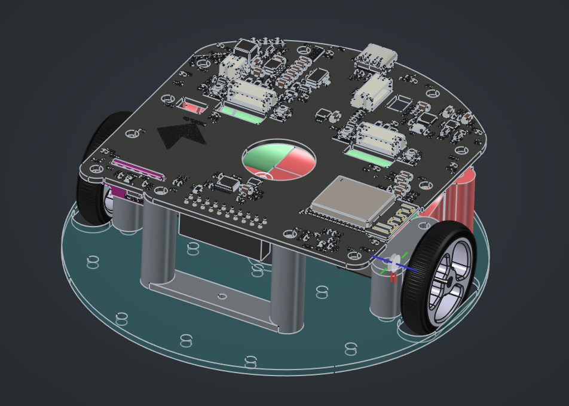

# Kabot Hardware

Kabot is an open-source, compact educational mobile robot. This repository contains its mechanical, electronic, and hardware production files.

## Project status

The hardware prototype is complete.

## FOSS toolchain

The hardware was designed entirely with free and open-source software (FOSS):

- [FreeCAD 1.1.1](https://www.freecad.org/) for the mechanical design
- [KiCad 10.0.4](https://www.kicad.org/) for the electronic design

Using these versions is recommended for the best compatibility with the source files.

## Repository structure

| Directory | Contents |
| --- | --- |
| [`freecad/`](freecad/) | FreeCAD mechanical source files for the chassis, battery holder, motor mounts, wheels, and related parts. |
| [`kicad/`](kicad/) | KiCad schematics, PCB layout, symbols, footprints, and supporting EDA files. |
| [`production/`](production/) | Files used to manufacture the PCB and print the chassis, including Gerber and drill files, a bill of materials (BOM), and pick-and-place data. |

## License

Copyright 2026 Krzysztof Pochwała.

The hardware design files are available under the [Creative Commons Attribution-NonCommercial-ShareAlike 4.0 International license](LICENSE.md) (CC BY-NC-SA 4.0). You may share and adapt the files with attribution, for non-commercial purposes, provided adaptations are distributed under the same license.

## More information

Visit [kabot.io](https://kabot.io/).